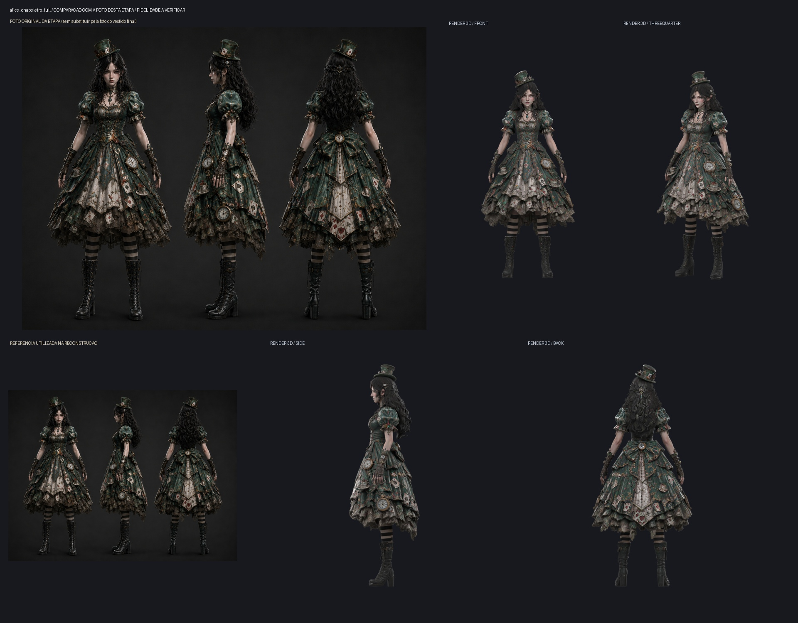

# Project Alice — vestido Chapeleiro em refinamento

O asset da galeria `Content/Assets/3D/personagens/alice-vestido-chapeleiro.glb` foi atualizado com um **novo conjunto completo** gerado no Tripo AI a partir de frente, perfil e costas da referência original. Preserva cartola, cartas, relógios, xícaras, avental, laço, meias e botas em geometria 3D real, com 1.890.825 triângulos e atlas 4K. O material da pele recebeu um primeiro ajuste local no Blender; o GLB original baixado foi preservado.

A foto original, os quatro renders e seus hashes estão em [checkpoint.json](checkpoint.json). A geração única consumiu 55 créditos, sem recursos premium. Polimento, separação de camadas e rig são feitos localmente.

O conjunto continua em trabalho. Faltam reconstruir e conferir as superfícies internas de cada camada, refinar cabelo, bordados e rendas, finalizar o rig e validar caminhada, corrida, salto, ataque e colisões do vestido. Este checkpoint estático não aprova fidelidade integral nem movimento para gameplay. A comparação de cada peça utiliza sua própria ficha de camadas, além da referência de conjunto mostrada aqui.

Os próximos refinamentos atualizam o mesmo nome de arquivo por novos commits; o histórico conserva as versões anteriores. Não iniciar outra geração antes de terminar todas as camadas e o rig do Chapeleiro. A Alice Base com vestido já aprovada é preservada.

Projeto original: **programador-powershell · Project Alice — Challenge**. Esta contribuição é uma extensão do projeto e conserva sua autoria e proveniência.
